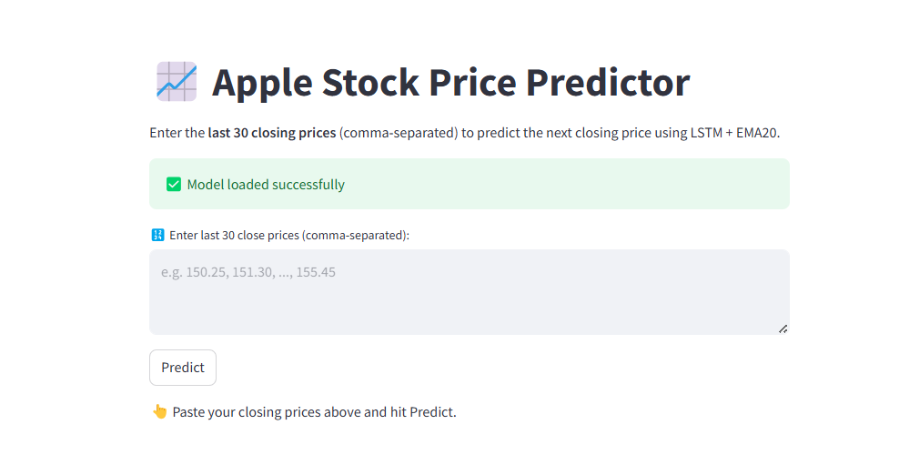

# 🍎 Apple Stock Price Predictor

This Streamlit web app uses a trained LSTM model with EMA20 (Exponential Moving Average) to **predict the next closing price of Apple stock** based on the last 30 closing prices.

---

## 🚀 Features

- 📈 Accepts the last **30 closing prices** of Apple stock as input
- 🤖 Uses **LSTM (Long Short-Term Memory)** neural network for time series forecasting
- 📉 Combines **EMA20 (technical analysis)** to improve prediction accuracy
- 📊 Displays the predicted next closing price along with a price trend graph
- 💻 Easy-to-use interface built with **Streamlit**

---

## 🛠️ Tech Stack

- Python 3.x
- Streamlit
- TensorFlow / Keras
- NumPy
- Pandas
- Scikit-learn
- Matplotlib

---

## 📂 Project Structure

apple-stock-predictor/
├── app.py # Main Streamlit app script
├── applestockprice_model.h5 # Pretrained LSTM model
├── requirements.txt # Python dependencies
└── README.md 

## 📥 Clone Repository

```bash
git clone https://github.com/your-username/apple-stock-predictor.git
cd apple-stock-predictor
```
## Install dependencies
pip install -r requirements.txt

## Launch Streamlit app
```bash
streamlit run app.py
```
## App Interface



